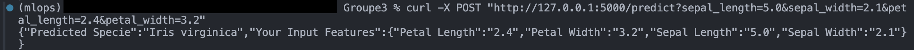
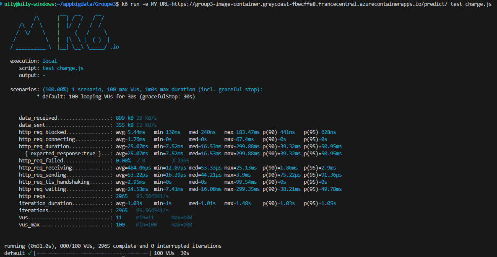
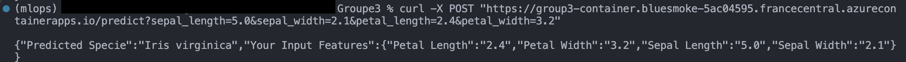
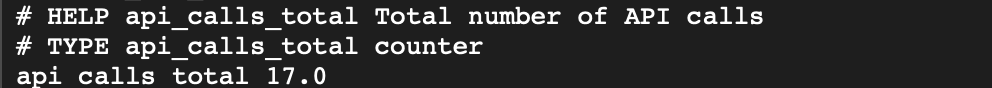

# Iris Prediction API (MLOps)

- App test in local (run get_model.py)
```
curl -X POST "http://127.0.0.1:5000/predict?sepal_length=5.0&sepal_width=2.1&petal_length=2.4&petal_width=3.2"
```



- Build docker image
```
docker build -t iris-predictor .
```

- Image run in local
```
docker run -p 5000:5000 iris-predictor
```

- Login to azure ACR
```
az login
az acr login --name efreibigdata.azurecr.io
```

- Tag the image
```
docker tag iris-predictor efreibigdata.azurecr.io/iris-predictor:latest
```

- Push image to azure
```
docker push efreibigdata.azurecr.io/iris-predictor:latest
az acr repository list --name efreibigdata.azurecr.io --output table
```

- Test charge (k6 avec js)
```
k6 run -e MY_URL=https://iris-predictor-container.bluesmoke-5ac04595.francecentral.azurecontainerapps.io/predict/test_charge.js
```



- Test predict on the app
```
curl -X POST "https://iris-predictor-container.bluesmoke-5ac04595.francecentral.azurecontainerapps.io/predict?sepal_length=5.0&sepal_width=2.1&petal_length=2.4&petal_width=3.2"
```



- Make 10 requests to test the api auto scaling
```
for i in {1..10}; do curl -X POST "https://iris-predictor-container.bluesmoke-5ac04595.francecentral.azurecontainerapps.io/predict?sepal_length=5.0&sepal_width=2.1&petal_length=2.4&petal_width=3.2"; done
```

- Prometheus /metrics
```
curl https://iris-predictor-container.bluesmoke-5ac04595.francecentral.azurecontainerapps.io/metrics
```

- Prometheus /metrics filtered on 'api_calls_total'
```
curl https://iris-predictor-container.bluesmoke-5ac04595.francecentral.azurecontainerapps.io/metrics | grep 'api_calls_total'
```


